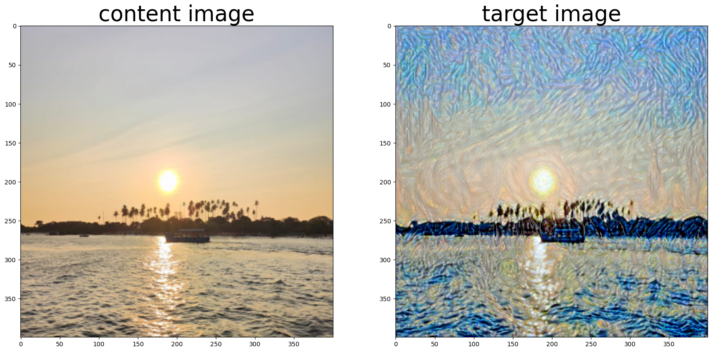
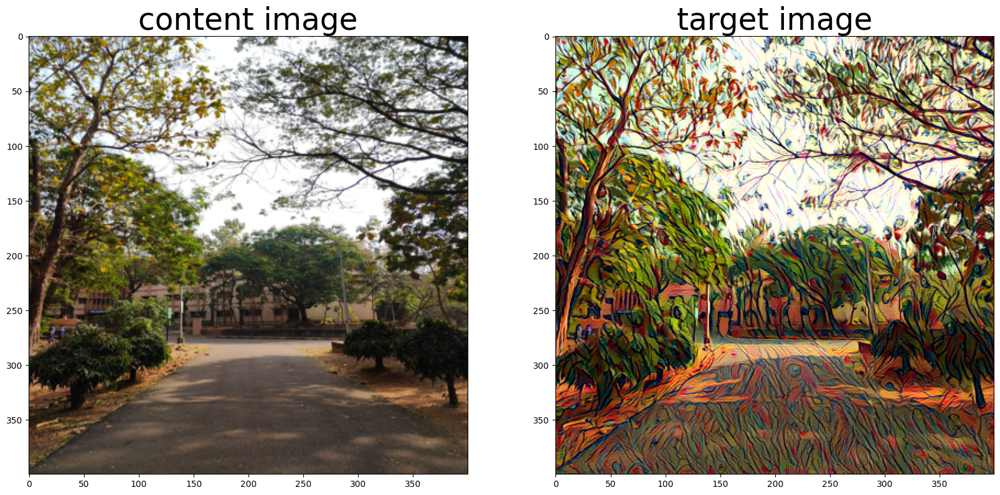
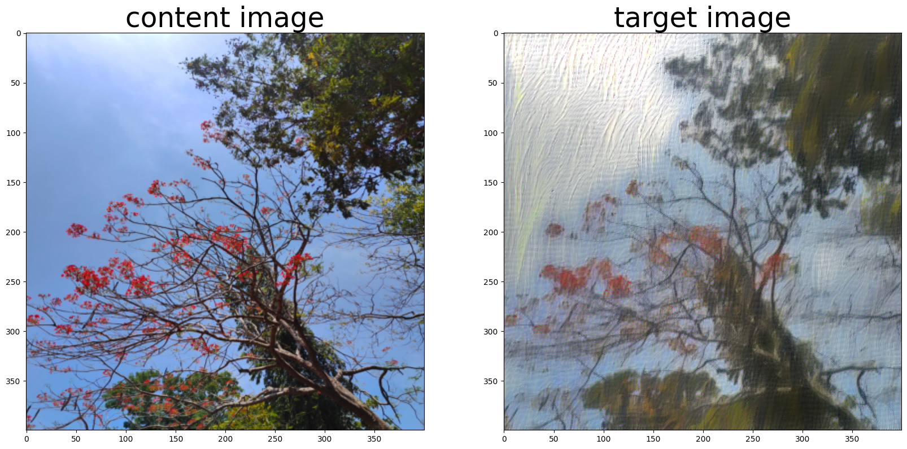

# Neural Style Transfer

This project implements neural style transfer, a technique that combines the content of one image with the artistic style of another image to create visually stunning results. It is based on the research paper titled "A Neural Algorithm of Artistic Style" by Leon A. Gatys, Alexander S. Ecker, and Matthias Bethge.

## Examples

## Acknowledgement

This implementation of neural style transfer is inspired by the research paper "A Neural Algorithm of Artistic Style" by Leon A. Gatys, Alexander S. Ecker, and Matthias Bethge. Their work laid the foundation for this project and the fascinating field of neural style transfer.
